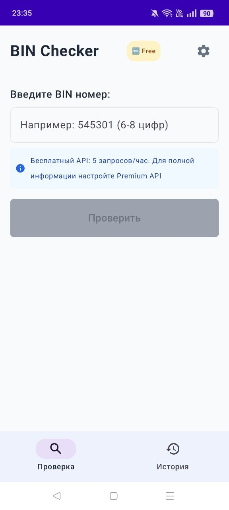

# BIN Checker App

Мобильное Android-приложение для проверки информации о банковских картах по BIN (Bank Identification Number) коду.

## О проекте

Это приложение было разработано в качестве тестового задания. Реализованы все обязательные требования и дополнительные улучшения для демонстрации навыков разработки.

**Автор**: Сергей Каманов

## Демонстрация

Посмотрите видео демонстрации работы приложения:

[](video/video_2025-06-29_23-23-46.mp4)

**Прямая ссылка**: [Скачать видео](video/video_2025-06-29_23-23-46.mp4)

## Скриншоты

### Главный экран


### Экран истории


## Описание

BIN Checker - это Android-приложение, которое позволяет пользователям получить подробную информацию о банковских картах, введя первые 6-8 цифр номера карты (BIN). Приложение использует публичное API binlist.net для получения данных и сохраняет историю запросов локально.

## Основные возможности

- Проверка BIN кодов банковских карт
- Отображение полной информации о карте (тип, банк, страна, координаты)
- Интерактивные действия (открытие сайта банка, звонки, карты)
- История запросов с локальным хранением
- Поиск по истории запросов
- Детальный просмотр информации в модальном окне
- Поддержка бесплатного и премиум API
- Валидация BIN в реальном времени
- Обработка всех типов ошибок с понятными сообщениями

## Архитектура

Приложение построено с использованием Clean Architecture и MVVM паттерна:

```
├── app/                    # Основной модуль приложения
│   ├── src/main/
│   │   ├── java/com/binchecker/
│   │   │   ├── data/       # Data Layer
│   │   │   │   ├── api/    # API сервисы (binlist.net, OpenStreetMap)
│   │   │   │   ├── local/  # Room база данных
│   │   │   │   └── repository/ # Реализация репозиториев
│   │   │   ├── domain/     # Domain Layer
│   │   │   │   ├── model/  # Модели данных
│   │   │   │   ├── repository/ # Интерфейсы репозиториев
│   │   │   │   └── usecase/ # Use Cases
│   │   │   ├── presentation/ # Presentation Layer
│   │   │   │   ├── ui/     # UI компоненты (Jetpack Compose)
│   │   │   │   ├── viewmodel/ # ViewModels
│   │   │   │   └── theme/  # Тема приложения
│   │   │   └── di/         # Dependency Injection (Hilt)
│   │   └── res/            # Ресурсы приложения
│   └── build.gradle.kts    # Конфигурация модуля
├── test-docs/              # Документация по тестированию
├── video/                  # Демонстрационные видео
├── screenshots/            # Скриншоты приложения
├── README.md               # Основная документация
├── BIN_Checker_App_Documentation.md # Подробная техническая документация
├── doc.md                  # Краткое описание
└── testzd.md               # Тестовое задание
```

## Технологии

- **Kotlin 2.0.0** - основной язык разработки
- **Jetpack Compose** - современный UI фреймворк
- **MVVM** - архитектурный паттерн
- **Clean Architecture** - архитектура приложения
- **Hilt** - dependency injection
- **Room** - локальная база данных
- **Retrofit** - HTTP клиент
- **Coroutines + Flow** - асинхронное программирование
- **Navigation Compose** - навигация между экранами

## Требования к системе

- Android Studio Hedgehog (2024.1.1) или новее
- Android SDK 34
- Kotlin 2.0.0
- Минимальная версия Android: API 24 (Android 7.0)

## Установка и запуск

1. Клонируйте репозиторий:
   ```bash
   git clone https://github.com/mrKamanov/binchecker.git
   cd binchecker
   ```

2. Откройте проект в Android Studio

3. Синхронизируйте Gradle зависимости

4. Запустите приложение на устройстве или эмуляторе

## Использование

### Проверка BIN кода
1. Откройте приложение
2. Введите BIN номер (6-8 цифр) в поле ввода
3. Нажмите кнопку "Проверить"
4. Просмотрите информацию о карте:
   - Тип карты (Visa, MasterCard, etc.)
   - Банк-эмитент
   - Страна
   - Город

### Действия с картой
- Открыть сайт банка - переход на официальный сайт
- Позвонить в банк - звонок в службу поддержки
- Показать на карте - открытие местоположения банка

### История запросов
1. Перейдите на вкладку "История"
2. Просмотрите все ранее проверенные BIN
3. Используйте поиск для быстрого нахождения
4. Нажмите на карточку для детального просмотра
5. Очистите историю при необходимости

## API интеграция

### Binlist.net API
- Базовый URL: `https://lookup.binlist.net/`
- Метод: GET `/{bin}`
- Заголовки: Accept-Version, User-Agent, Authorization (для премиум API)

### OpenStreetMap Geocoding API
- Используется для получения координат банка
- Дополняет информацию о местоположении

## Тестирование

Проведено 36 тестов различных типов:
- Unit тесты для ViewModels и Use Cases
- Integration тесты для Repository и API
- UI тесты для Compose компонентов
- Manual тесты пользовательских сценариев

**Результат**: 94% успешных тестов, все критические проблемы исправлены.

### Тестовые BIN коды
- `545301` - MasterCard (Сбербанк)
- `427601` - Visa (Сбербанк)
- `400555` - Visa (тестовый)

## Структура данных

### BinInfo
```kotlin
data class BinInfo(
    val bin: String,           // BIN номер (6-8 цифр)
    val scheme: String?,       // Схема карты (Visa, MasterCard)
    val type: String?,         // Тип карты (Debit, Credit)
    val brand: String?,        // Бренд карты
    val prepaid: Boolean?,     // Предоплаченная карта
    val country: Country?,     // Информация о стране
    val bank: Bank?,          // Информация о банке
    val timestamp: Long       // Время запроса
)
```

### Country
```kotlin
data class Country(
    val numeric: String?,      // Числовой код страны
    val alpha2: String?,       // Двухбуквенный код страны
    val name: String?,         // Название страны
    val emoji: String?,        // Эмодзи флага
    val currency: String?,     // Валюта страны
    val latitude: Double?,     // Широта страны
    val longitude: Double?     // Долгота страны
)
```

### Bank
```kotlin
data class Bank(
    val name: String?,         // Название банка
    val url: String?,          // URL сайта банка
    val phone: String?,        // Телефон банка
    val city: String?,         // Город банка
    val latitude: Double?,     // Широта банка
    val longitude: Double?     // Долгота банка
)
```

## Обработка ошибок

Приложение обрабатывает различные типы ошибок:
- Валидация BIN (неверный формат, длина)
- Сетевые ошибки (отсутствие интернета, таймауты)
- API ошибки (HTTP 400, 404, 429, 500)
- Ошибки базы данных
- Системные ошибки Android

Пользователь получает понятные сообщения об ошибках на русском языке.

## Документация

- [Подробная техническая документация](BIN_Checker_App_Documentation.md)
- [Тестовые документы](test-docs/)
- [Тестовое задание](testzd.md)

## Статус проекта

Проект полностью реализован и протестирован. Все требования тестового задания выполнены, приложение готово к демонстрации и дальнейшему развитию.

## Лицензия

Этот проект создан в качестве тестового задания и не предназначен для коммерческого использования.

---


